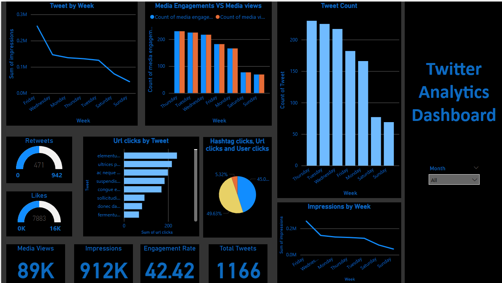

# 📊 Twitter Analytics Dashboard using Power BI

This project presents a comprehensive **Twitter Analytics Dashboard** developed in **Power BI**, based on real Twitter engagement data. The dashboard provides insights into user interactions, tweet performance, impressions, and click-through behavior over time.

## 📌 Features

- 📅 **Tweet Activity by Day**: Visualizes total impressions and tweet volume across the week  
- 🔁 **Retweets & Likes**: Shows engagement volume and trends  
- 📈 **Engagement vs Media Views**: Compares user media interactions with media impressions  
- 🔗 **URL Clicks by Tweet**: Highlights top-performing links  
- 🧵 **Hashtag & User Click Breakdown**: Pie chart showing relative interaction types  
- 🧠 **Insights Summary**:
  - Tweets on **Tuesdays to Thursdays** perform best.
  - Engagement and impressions drop over weekends.
  - Top tweets correlate with higher media views and URL clicks.

## 🛠 Tools & Technologies

- **Power BI**  
- **Power Query**  
- **Data Visualization**  
- **CSV File Processing**  
- **DAX for Metrics Calculation**

## 📁 Dataset

- Format: CSV  
- Fields: `Tweet Date`, `Impressions`, `Likes`, `Retweets`, `Media Views`, `Engagement`, `URL Clicks`, `Hashtag Clicks`, etc.

## 📷 Dashboard Preview

## 🚀 Getting Started

To explore or edit the dashboard:

1. Clone the repository  
2. Open `twitterAnalytics.pbix` in **Power BI Desktop**  
3. Load the `SocialMedia.csv` file if prompted  
4. Interact with slicers, filters, and charts

## 🤝 Let’s Connect

I'm currently open to **Data Analyst roles** and looking to apply my skills in solving real-world business problems.  
Feel free to reach out or connect with me on [LinkedIn](https://www.linkedin.com/in/gonepraveen/)!

---

## 🔖 Tags

`#DataAnalytics` `#PowerBI` `#SocialMediaAnalytics` `#DashboardDesign` `#DataVisualization`  
`#BusinessIntelligence` `#DataAnalystPortfolio` `#TwitterData`
